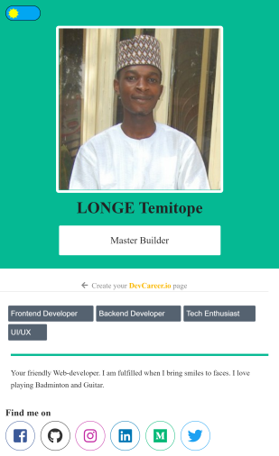

# DevCareerProfilePage
DevCareer profile page

This is the second & third task in the #DevTask project organized by @hackSultan on twitter. The main task was a clone of the devcareer profile page while the additional task involved creating a dark mode for the page. 

The bulk of the work was done via HTML and CSS. Javascript was only used to perform switching from the light theme to dark theme with the associated transition effect.

## Screenshots

## Live Demo

[Hosted Link](https://happy-jennings-1d8b38.netlify.app)

## Author

Longe Temitope
- Github: [@tamsay](https://github.com/tamsay)
- Twitter: [@longetope](https://twitter.com/longetope)

## 🤝 Contributing

Contributions, issues and feature requests are welcome!

Feel free to check the [issues page](https://github.com/tamsay/DevCareerProfilePage/issues)

## Show your support

Give a ⭐️ if you like this project!

## Acknowledgments

Project inspired by @hackSultan (DevTask)